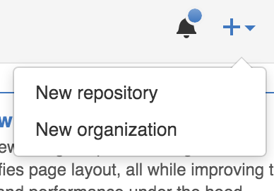

# Basic Git Course

### Index

### What is a Version Control Software?

Version control software allows you to have “versions” of a project, which show the changes that were made to the code
over time, and allows you to backtrack if necessary and undo those changes.

We also have the idea of centralized version control server, where multiple developer could pull the latest changes and
then push to the server the changes made. But what happens if the server is down. There's where Git comes in.

### What is Git?

With Git, the develipers don’t just check out the current version of the files and work from them, they actually mirror
the entire version history. Each developer always has a complete copy of everything.

A central server is still used, but should the worst happen, then everything can still be restored from any of the
developers who have the latest versions.

Git takes “snapshots” of files, if files remain unchanged in a particular version, it simply links to the previous
files.

### What is GitHub?

Github is both a remote server, a community of developers, and a graphical web interface for managing your Git project.
It’s free to use for public repositories and low cost plans for private projects. Other two good examples for Git remote
servers are BitBucket and Stash.

### First steps

To start working on a project using git we have three choices, the first one is to create our own repository in one of
the previous server, for this example we will choose GitHub.

Supposing that we already have a GitHub account, we need to go the the main page of the remote server and create the
repository. This is accomplished by clicking the + Icon and then selecting the right option of the dropdown menu.

### Working with git

### Collaborating into a project with git

